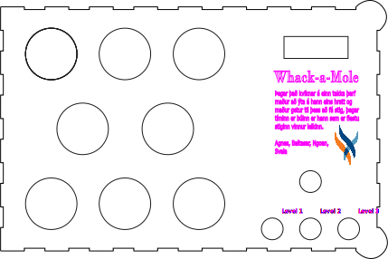

# Whack-a-Mole borðspilið 
### Agnes, Baltasar, Ngoan og Svala

### Agnes komin inn á github
Höfundar og stutt lýsing á borðspili og leikjaspilun. - Höfundar spilsins eru Agnes, Baltasar, Ngoan og Svala. Við feyngum innbástur frá klasíska leikjasala leiknum Whack-a-mole og reyndum að gera okkar eigin gerða að þeim leik upp frá grunni. Flestir hafa spilað eða kannakst einhvað við Whack-a-mole leikin, ef þu ert ein/nn af þeim fáu sem hafa aldrei frétt að þessum leik er hann svakalega einfaldur, á kassanum okkar eru 8 stórir takkar, á nokkur hunrað millisekundu fresti kveiknar á einum af þeim takka, þegar það kveiknar á takka þarft þú einfaldlega að ýtta á hann áður en það kviknar á næsta. Leikurinn okkar telur "Highscore" og stign sem þú hefur. Það er einnig hæght að velja á milli triggja erfiðleika stiga, á fyrsta stiginu er 600 ms tímabil sem er kveikt á takka *minnir mig*, á öðru stiginu er 500ms bil og á þriðja er 400 ms bil.
Stutt myndband af spilavirkni.
Ljósmyndir af borðspili (inní kassa og utan)
vidjo

Ljósmyndir af lóðun (báðar hliðar).
Hönnunarteikning (.svg) af Borðspili, (stilla blaðsíðustærðina í Inkscape þannig að hún sé eins og stærðin á kassanum).
Tengil á kóðaskrá main.py.

mynd

